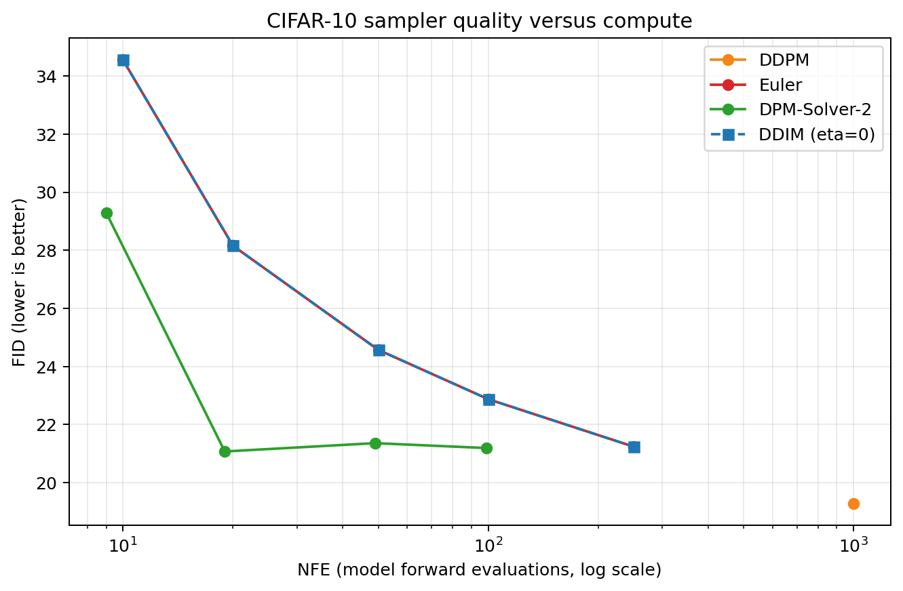

# 项目 2 ：Samplers 报告

> 实现、理论分析和 AutoDL 正式测量均已完成。下列数值全部来自已记录的
> JSON 结果文件。

## 1. 实验协议

- 模型：项目 1 CIFAR-10 linear 调度策略的随机种子 44 checkpoint，使用 EMA 权重。
- FID 真实图集合：固定使用前 5,000 张 CIFAR-10 训练图，不使用随机增强。
- 生成图集合：每个配置生成 5,000 张图，每个配置开始前都将随机种子重置为 42。
- 数据范围：训练和采样数据在 `[-1,1]`；FID 输入转换为 `[0,255]` 的 RGB
  `uint8`。
- 计算环境：AutoDL NVIDIA RTX 4090（24,564 MiB），Python 3.12.3，PyTorch
  2.8.0+cu128，CUDA 12.8。
- checkpoint SHA256：`937853559a1377660f7d4cbd1dd3f7c6cf022aed4ab84e9daa918aa6e34541412`。
- AutoDL 仓库提交：`e8f8af6698570485b9909ca1755f0266a09e4da8`；权重从嵌套 EMA
  状态中加载。

## 2. DDIM 推导和实现

训练好的模型预测前向过程中的噪声：

$$
x_t=\sqrt{\bar\alpha_t}x_0+\sqrt{1-\bar\alpha_t}\epsilon.
$$

由上式求解干净图像得到：

$$
\hat x_0(x_t)=
\frac{x_t-\sqrt{1-\bar\alpha_t}\epsilon_\theta(x_t,t)}
{\sqrt{\bar\alpha_t}}.
$$

对于跳步时间序列中任意相邻的 `t > t_prev`：

$$
\sigma^2=
\eta^2\frac{1-\bar\alpha_{t_{prev}}}{1-\bar\alpha_t}
\left(1-\frac{\bar\alpha_t}{\bar\alpha_{t_{prev}}}\right),
$$

$$
x_{t_{prev}}=
\sqrt{\bar\alpha_{t_{prev}}}\hat x_0+
\sqrt{1-\bar\alpha_{t_{prev}}-\sigma^2}\epsilon_\theta+
\sigma z.
$$

实现会将平方根参数截断到不小于零，保护 `alpha_bar` 很小时的除法，并将生成
的干净图像预测裁剪到 `[-1,1]`。当 `eta=0` 时，不会额外采样随机噪声。

## 3. FID 与 NFE

| 采样器 | 步数 | 真实 NFE | FID | 采样时间 |
|---|---:|---:|---:|---:|
| DDPM | 1000 | 1000 | 19.290 | 1010.7 s |
| DDIM | 10 | 10 | 34.555 | 10.1 s |
| DDIM | 20 | 20 | 28.159 | 20.1 s |
| DDIM | 50 | 50 | 24.574 | 50.9 s |
| DDIM | 100 | 100 | 22.875 | 100.6 s |
| DDIM | 250 | 250 | 21.241 | 251.9 s |
| Euler | 10 | 10 | 34.555 | 10.1 s |
| Euler | 20 | 20 | 28.159 | 20.3 s |
| Euler | 50 | 50 | 24.574 | 50.4 s |
| Euler | 100 | 100 | 22.875 | 100.9 s |
| Euler | 250 | 250 | 21.241 | 251.4 s |
| DPM-Solver-2 | 5 | 9 | 29.295 | 9.3 s |
| DPM-Solver-2 | 10 | 19 | 21.074 | 19.3 s |
| DPM-Solver-2 | 25 | 49 | 21.361 | 49.4 s |
| DPM-Solver-2 | 50 | 99 | 21.192 | 100.5 s |

每个点都使用相同的训练网络、checkpoint、5,000 张真实图和随机种子，因此曲线
变化反映的是离散化或求解器行为，而不是重新训练的影响。DDIM 随步数增加而
稳定改善，FID 从 10 NFE 时的 34.555 降至 250 NFE 时的 21.241。课程 starter
中的 Euler 实现与 `eta=0` 的 DDIM 使用相同的确定性离散 probability-flow 更新，
所以数值完全一致。DPM-Solver-2 在低计算量下最有优势：19 NFE 时 FID 为
21.074，接近 DDIM 250 NFE 的结果，且明显优于 DDIM 20 NFE。DDPM 的绝对 FID
最佳（19.290），但需要 1,000 NFE。

## 4. 采样轨迹

测量结果见 `runs/trajectory_comparison.json`。所有行都使用相同的初始噪声
（`same_initial_noise=true`）和真实时间步标签。在 50 个外层步时，DDPM 使用
1,000 NFE，平均单步 L2 为 5.255；DDIM/Euler 使用 50 NFE，平均单步 L2 为
1.131；DPM-Solver-2 使用 99 NFE，平均单步 L2 为 1.123。DDPM 在初始化之后
仍然是随机过程，而其他配置是确定性的。

## 5. DPM-Solver-2

令 $\lambda=\log(\alpha/\sigma)$，扩散 ODE 的线性部分可以解析积分。实现
分别在源点和离散 lambda 中点的最近时间步评估网络，然后应用指数中点更新。
当运行 `S` 个外层步时，网络实际评估次数为 `2S-1`，因为最后的干净图像投影
只需要一次评估。

正式对比表明，二阶中点修正在低 NFE 区间最有用：DPM-Solver-2 的 FID 从 9 NFE
时的 29.295 降至 19 NFE 时的 21.074，随后在 49–99 NFE 附近稳定在 21.2。
25 步结果略差于 10 步（21.361 对 21.074），这是有限模型和离散时间网格造成的
现象，并不意味着固定 seed 下增加评估次数必然改善 FID。真实模型调用次数
`2S-1` 已同时记录在 benchmark JSON 和 sampler 自测中。

## 6. DDIM 反演

反演严格沿采样时间序列的反方向执行，并使用当前状态的噪声预测近似无法直接
获得的目标时间噪声。反演和重构都关闭干净图像裁剪，避免裁剪人为破坏往返过程。

评估使用 CIFAR-10 测试集索引 0–63，并在往返过程中关闭裁剪。结果见
`runs/inversion_results.json`：

| 步数 | 平均 L2 | MAE | MSE | PSNR |
|---:|---:|---:|---:|---:|
| 10 | 18.2820 | 0.26955 | 0.11417 | 15.891 dB |
| 20 | 12.5195 | 0.18369 | 0.05343 | 19.175 dB |
| 50 | 5.0287 | 0.07314 | 0.00864 | 27.057 dB |
| 100 | 2.3665 | 0.03419 | 0.00197 | 33.644 dB |
| 250 | 0.9316 | 0.01332 | 0.00032 | 41.836 dB |

误差随反演步数增加单调且显著下降。对于本 checkpoint 和时间步策略，增加步数
带来的局部截断误差下降足以抵消模型预测误差的累积影响。

## 7. 必答自查问题

### 7.1 为什么 DDIM 是确定性的？

当 `eta=0` 时，$\sigma=0$，更新式中不再包含新采样的 `z`。因此，相同的
模型、调度策略、时间步序列、权重和初始 $x_T$ 会定义相同的数学输出。在 GPU
上要实现逐比特完全一致，还需要确定性 kernel 以及固定的软件和硬件环境。

### 7.2 cosine 训练模型应如何选择 100 个 DDIM 时间步？

均匀的整数索引并不代表噪声水平的等量变化，而且 cosine 调度策略对
$\bar\alpha_t$ 的分布不同于 linear 调度策略。更合理的做法是按 log-SNR
均匀布置推理点（或通过 $\bar\alpha_t$ 匹配目标噪声水平），再将它们映射回
不重复的离散训练索引。复用相同整数索引在形式上可行，但无法在去噪路径上提供
相同的数值分辨率。

### 7.3 为什么改变 eta 会改变质量？

`eta` 在确定性的 ODE-like 轨迹和随机 ancestral 更新之间进行折中。注入噪声
可以增加轨迹多样性，但在步数较少、单步跨度较大时，也会引入剩余更新难以完全
消除的方差。因此 `eta=0` 通常在低步数下具有更好的保真度，而偏大的 eta 在
更重视多样性时可能更有价值。

### 7.4 为什么 DDIM 更新可以退化为 DDPM？

对于连续时间步，并令

$$
\sigma_t^2=\tilde\beta_t=
\frac{1-\bar\alpha_{t-1}}{1-\bar\alpha_t}\beta_t,
$$

将
将 $\hat x_0=(x_t-\sqrt{1-\bar\alpha_t}\epsilon_\theta)/
\sqrt{\bar\alpha_t}$ 代入 DDIM 均值，并收集 $x_t$ 与 $\epsilon_\theta$
的系数，可得

$$
\mu_\theta=
\frac{1}{\sqrt{\alpha_t}}
\left(x_t-\frac{\beta_t}{\sqrt{1-\bar\alpha_t}}
\epsilon_\theta\right).
$$

剩余的随机项为 $\sqrt{\tilde\beta_t}z$，正好是 DDPM ancestral 更新。该
等价关系要求时间步连续且不额外进行干净图像裁剪；跳步时的 `eta=1` 更新只是
类似 DDPM，并不是原始 DDPM 的 Markov 链。
