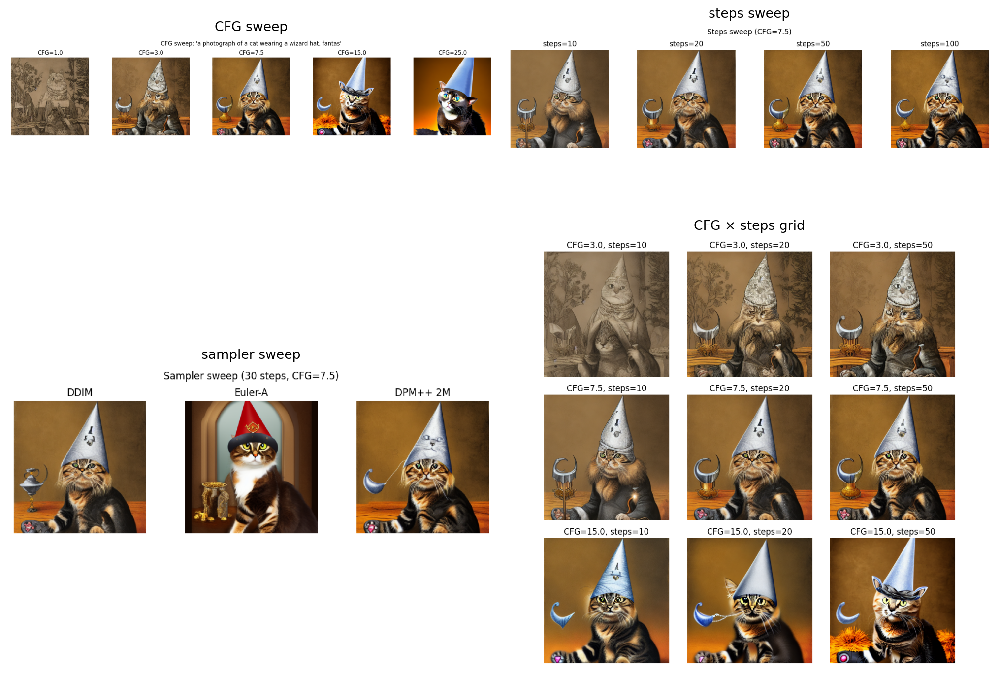
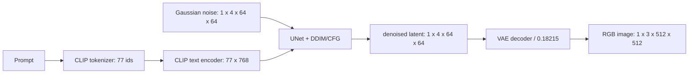
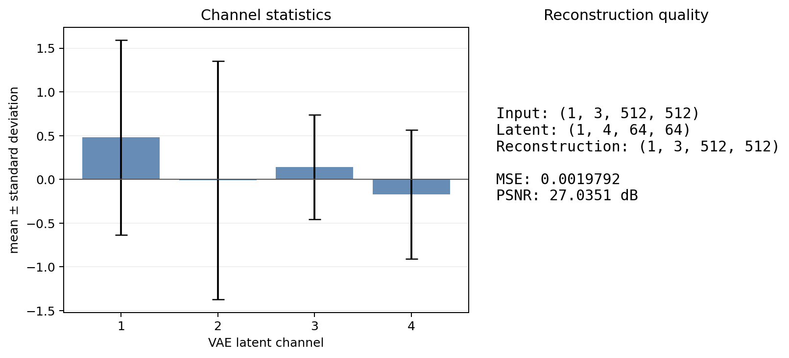
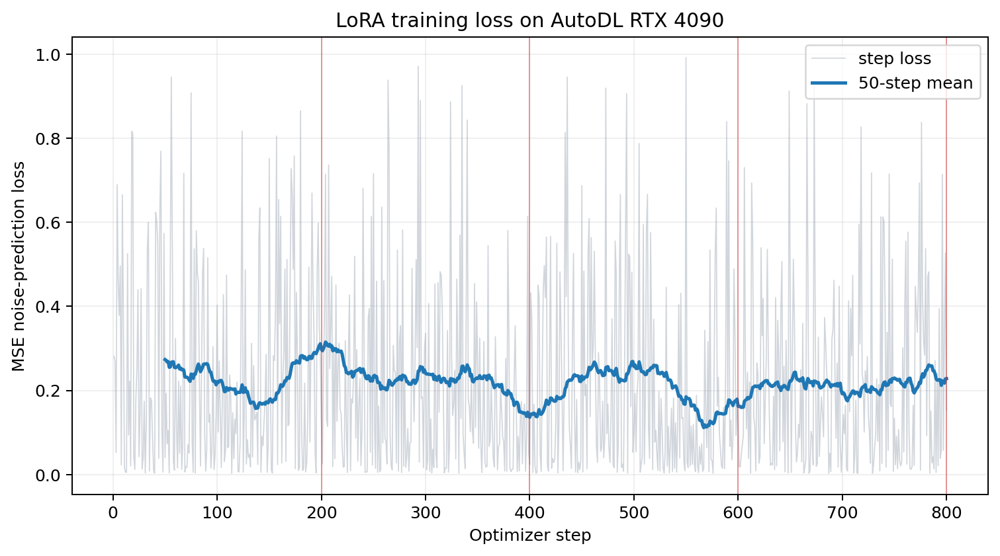

# Project 3：Stable Diffusion 全流程实验报告

> 本报告对应 `my-diffusion-models-starter` 的 `main` 分支。代码默认固定
> `stable-diffusion-v1-5/stable-diffusion-v1-5` revision
> `451f4fe16113bff5a5d2269ed5ad43b0592e9a14`；AutoDL 实测因 Hugging Face
> endpoint 不可达，使用 ModelScope 的标准 Diffusers 镜像
> `AI-ModelScope/stable-diffusion-v1-5@master`，来源和权重 SHA256 见
> `outputs/autodl_environment.json`。模型权重、HF cache、训练原图和临时
> checkpoint 均不进入 Git。

AutoDL 安装基线写在 `requirements/project3.txt`：PyTorch 2.8.0 / torchvision
0.23.0（CUDA 12.8 镜像）、Diffusers 0.40.0、Transformers 5.15.1、PEFT 0.20.0、
Accelerate 1.14.0、Hugging Face Hub 1.31.0。本机 smoke 使用同一上层库版本，
但 PyTorch 为本机 CUDA 12.6 build，不能替代 AutoDL 结果。

## 0. 当前交付状态

代码、测试、执行后的 A/C/E notebook、full sweep、ControlNet、cross-attention 和
800-step LoRA 均已在 AutoDL RTX 4090 上完成并回传。AutoDL 环境为 Python 3.12.3、
PyTorch 2.8.0+cu128、CUDA 12.8、显存 24 GB；所有命令、依赖、运行时间和产物
SHA256 写入 `outputs/autodl_environment.json` 及各实验 metadata。训练原图只保留在
AutoDL 被忽略目录 `.local/datasets/project3_vangogh`。

### 0.1 对照原始 Project 3 要求的完成度

| 要求 | 状态 | 证据 |
|---|---|---|
| A：禁止高层 pipeline 的手写推理 | ✅ 完成 | `01_inference_walkthrough.ipynb` 已执行；测试检查无 `StableDiffusionPipeline`/`pipe(` |
| B：CFG、steps、DDIM/Euler-A/DPM++ 2M 扫描 | ✅ 完成 | `outputs/sweep/` 的 16 张单图、4 张汇总图和 `metadata.json` |
| C：VAE 四通道、重构、局部细节和指标 | ✅ 完成 | `05_vae_anatomy.ipynb`、`outputs/vae_*.png`、`vae_metrics.json` |
| D：LoRA TODO 13–15、800 steps、checkpoint、独立重载 | ✅ 完成 | `outputs/lora/full/`、`outputs/lora/full_eval/`、training JSONL |
| E：ControlNet 与 cross-attention challenge | ✅ 完成 | `outputs/controlnet/`、`outputs/attention/full/` |
| LDM §3–4 / SDXL 阅读笔记 | ✅ 完成 | `notes/reading_note_ldm.md`，并保留 `reading_notes/ldm_sdxl_reading_note.md` |
| 可复现记录与真实 debug | ✅ 完成 | `outputs/autodl_environment.json`、`logs/`、本报告第 7 节 |
| 网络与数据限制 | 已记录 | Hugging Face/Commons API 在 AutoDL 不可达，使用 ModelScope 镜像并记录来源、许可说明和 SHA256；check_env 的远端 HEAD 检查因此不能作为唯一验收依据 |

结论：按功能、产物和实验验收标准，Project 3 已完成；唯一需要注意的是 AutoDL 的基础模型和训练数据使用了可审计的镜像来源，而不是原计划的在线 Hugging Face/Wikimedia 端点。AutoDL 是从独立运行目录执行的，metadata 中的 git_commit 为 null；代码提交与产物对应关系以本仓库的 main 提交和本报告为准。

### 0.2 报告图表总览

下面的汇总图由仓库内的 `make_report_figures.py` 根据已提交的 JSON、JSONL 和 PNG 产物重新生成，不包含任何未提交模型权重或训练原图。

  

## 1. 总体流程与 shape 来源

- SD 1.5 的 VAE 将 512×512 RGB 图像下采样 8 倍，因此 latent 空间为
  `(batch, 4, 64, 64)`；4 是 VAE 的 latent channel 数。
- CLIP tokenizer 固定 padding/truncation 到 77；CLIP text encoder hidden size
  为 768，UNet cross-attention 因而接收 `(batch, 77, 768)`。
- CFG 将 unconditional 和 conditional embedding 拼成 `(2,77,768)`，UNet 一次
  前向后按 batch 拆分，`eps = eps_u + s(eps_c-eps_u)`。
- VAE 的 `scaling_factor=0.18215` 只在 latent 与 decoder 之间变换，不能省略。

## 2. A：手写推理

`01_inference_walkthrough.ipynb` 不导入或调用 `StableDiffusionPipeline(prompt)`，而是
显式完成 tokenizer、text encoder、噪声初始化、DDIM 50 步、CFG 和 VAE decode。该
notebook 已执行并保留 execution count、文本及图片输出。

固定配置：prompt 为 astronaut/horse/mars，negative prompt 为
`low quality, blurry, distorted`，seed=42，steps=50，CFG=7.5。执行过程中记录
step 0、9、24、49 的 latent 统计量；最终 latent 仍为 `(1,4,64,64)`，图像为
`(1,3,512,512)`。`manual_sd_seed42.png` 和 `manual_sd_stats.json` 同时由 notebook
AutoDL notebook 生成并回传，其中记录 step 0、9、24、49 的 latent 演化和最终 SHA256。

思考题：

1. `cfg=0` 时是 unconditional 预测，prompt 只影响 conditional 分支而不会被采用。
2. 只用 `cond_emb` 等价于不做 CFG；仍是条件采样，但失去 unconditional 方向的外推。
3. 改变 `init_noise_sigma` 会改变 scheduler 期望的初始噪声尺度，通常造成亮度、对比度
   和细节异常；应使用 scheduler 给出的值。
4. 反向采样时 latent 的噪声尺度逐步下降，和 DDPM forward 加噪相反，但每一步还受到
   UNet 预测和 scheduler 参数化的影响，并非简单取逆。
5. steps=5 只给 scheduler 很少的校正机会，结构和纹理通常明显变差；增加 steps
   能降低离散化误差，但超过某一点收益递减。

## 3. B：CFG / steps / sampler 扫描

`02_parameter_sweep.py` 保留作业规定的 full 网格：CFG `[1,3,7.5,15,25]`、steps
`[10,20,50,100]`、DDIM/Euler-A/DPM++ 2M，并统一 prompt、negative prompt、seed=42。
新增 `--preset smoke|full`、`--model_revision`、`--metadata_output`，每张单图、四张
总图和 JSON SHA256 清单均自动保存。smoke preset 用 2×2 的小网格快速检查依赖、显存
和文件链路；full preset 才是 AutoDL 交付配置。

解释：CFG 从 1 增大到中等值时 prompt adherence 通常增强；过大的 CFG 会过饱和、边缘
发硬或出现伪影。steps 增加主要改善早期结构和细节，但采样器的离散化方式也会改变
结果，不能把 steps 与 sampler 的影响混为一谈。AutoDL full sweep 的 `metadata.json`
记录 16 张单图、3 张 sampler/CFG/steps 总图和 1 张 2D grid，512×512、seed=42、
耗时 36.642 秒；报告结论以这些实测产物为准。

  

  

  

  

四张图的阅读顺序是：先看 CFG 对 prompt adherence 和伪影的影响，再看 steps 对结构/细节的影响，最后比较 sampler 的离散化差异；二维网格用于观察 CFG 与 steps 的交互，而不是替代前三组单变量实验。

## 4. C：VAE anatomy

`05_vae_anatomy.ipynb` 使用 posterior mode（确定性，不从 posterior 采样），保存四个
latent channel、原图/重构图、右下角细节 crop 和 metrics JSON。已执行成功，得到：

| tensor | shape |
|---|---|
| 输入 RGB | `(1,3,512,512)` |
| latent | `(1,4,64,64)` |
| 重构 RGB | `(1,3,512,512)` |

AutoDL 本次输入（`outputs/sweep_smoke/grid_2d.png`）指标为 MSE=`0.0019791808`、
PSNR=`27.0351 dB`（指标定义在 notebook 中，范围为 `[0,1]`）；四个 channel 的
均值/std 写入 `outputs/vae_metrics.json`。本机先前的 512×512 单图 smoke 指标
`1.6900175e-4 / 37.7211 dB` 仅作为对照，不与 AutoDL 数字混用。
VAE 是有损压缩：低频颜色和大形状保持较好，细小文字、尖锐边缘和纹理会被平滑。

  

  

  

  

## 5. D：LoRA

实现位于 `03_lora_finetune.py`：冻结 VAE、text encoder 和 UNet base，只注入
`to_q/to_k/to_v/to_out.0`，rank=8、alpha=8；LoRA master 参数强制 FP32，前向使用
FP16 autocast/GradScaler，支持 gradient checkpointing、max-grad-norm、JSONL 日志和
每 200 步 adapter checkpoint。默认训练配置是 512×512、batch=1、AdamW、lr=1e-4、
800 optimizer steps、seed=42。

`evaluate_lora.py` 会从全新 pipeline 逐个加载 base、checkpoint-0200/0400/0600/0800，
使用相同 prompt/seed 生成对比图，结果在 `outputs/lora/full_eval/`。AutoDL 实测
20 张训练图、800 steps 耗时 209.47 秒，初始 loss=`0.2810367`、最终
loss=`0.1527308`、last-50 mean=`0.2282097`，无 NaN/Inf；最终 adapter 为
6,414,448 bytes（约 6.4 MB）。重要实现细节是 `UNet.save_lora_adapter` 生成的
UNet-only safetensors 必须通过 `unet.load_lora_adapter(..., prefix=None,
weight_name=...)` 重载；直接用 pipeline API 会静默忽略未带 `unet.` 前缀的 keys。
该问题已用本地 2-step smoke 复现并修复。

  

  

loss 曲线中浅色线是单步噪声预测 loss，深色线是 50-step 滑动平均；红色竖线对应 200、400、600、800-step checkpoint。单步 loss 波动较大是 batch=1 和随机 timestep 的预期现象，应结合滑动平均、固定 prompt/seed 图像和最终 adapter 重载结果判断，而不是只看最后一个 batch。

## 6. E：ControlNet 与 cross-attention challenge

`04_controlnet_demo.ipynb` 先计算 Canny，再以同一结构运行四个风格 prompt，并额外
运行“同一边缘图但 prompt 要求 golden retriever dog”的冲突实验。AutoDL 已生成
`controlnet_prompt_00..03.png`、`controlnet_grid.png`、输入/Canny 图和冲突图，
metadata 同时记录阈值 `[100,200]`、seed=42 及 SHA256。ControlNet 通过
zero-convolution 将条件分支的 residual 注入冻结的 SD UNet：初始 zero 保证训练初期
不破坏 base，训练后才逐渐改变结构特征。

`06_cross_attention_visualization.py` 安装自定义 processor，只保存 CFG conditional
half，在中后期 timestep 聚合 16×16/32×32 query map，排除 BOS/EOS/padding，再插值叠加
到生成图。AutoDL 30-step 实测捕获 `cat/wizard/hat/forest` 四个有效 token，聚合
32 个 attention 层的 16×16/32×32 map，输出 4 张 heatmap overlay、generated 图和
metadata；数值有限，BOS/EOS/padding 已排除。另有 5-step smoke 产物用于快速回归。

  

  

  

  

  

  

  

ControlNet 图组用于判断“同一结构能否被不同 prompt 重绘”，冲突图用于判断结构条件与文本语义的权衡；attention 图则把 token 与空间区域的对应关系显式化。

## 7. 真实 debug 记录

1. 旧 `huggingface_hub` 与 diffusers 0.40 的 `cached_download` 接口不兼容，导致导入
   失败；升级到锁定组合中的 huggingface_hub 1.31.0 后恢复。
2. Windows 工作站的目标仓库输出目录 ACL 对普通 Python 进程只读；运行产物改放到
   仓库外持久盘，AutoDL 按计划使用 `.local/` 和仓库 `outputs/`。
3. LoRA 初版评估图与 base SHA256 完全相同；检查 state dict 后发现 pipeline loader
   因缺少 `unet.` 前缀而忽略 adapter，改用 UNet loader 并显式传 `prefix=None` 后图像
   SHA256 产生可解释变化。
4. cross-attention 初版在 `norm_cross=None` 的模块调用了
   `norm_encoder_hidden_states`，触发 assertion；现在只在 `norm_cross` 为真时归一化。
5. tokenizer token 名含 `<`、`>`，Windows 文件名保存失败；输出 label 现在用安全字符
   过滤并保留 token index。
6. AutoDL 访问 Wikimedia Commons 时出现 `OSError: [Errno 99] Cannot assign requested
   address`；为保持可复现实测，改用 ModelScope 公共 `huggan/vangogh2photo` 镜像的
   20 张 `imageA`，其来源、许可证说明和 SHA256 写入 `outputs/lora/vangogh_manifest.json`。
   Commons 版本 downloader 仍保留在源码中，未把镜像冒充为 Commons 原图。

## 8. AutoDL 执行与验收

在 AutoDL 4090/24GB 实例上，从独立运行目录开始，Project 3 pytest（5 passed）、
5-step manual/sweep smoke、2-step LoRA 保存/重载、单 prompt ControlNet 和 attention
smoke 全部通过；随后执行 full sweep、三个 `nbconvert --execute --inplace` notebook、
800-step LoRA、ControlNet 四风格+冲突和 30-step attention challenge。长任务置于
tmux（`p3_sweep`、`p3_lora`），stdout、JSONL、metadata 和 SHA256 均已保留。

验收必须同时满足：LoRA 无 NaN/Inf 且 adapter <25MB；四张 sweep 总图、四张以上
ControlNet 结果和冲突图齐全；attention metadata 只包含有效 token 和 16/32 分辨率；
仓库不含基础权重、HF cache、原图或临时 checkpoint；`scripts/check_repo.py` 和
Project 3 tests 通过；最后正常 `git pull --rebase`（如有远端更新）后推送，禁止
force-push。
