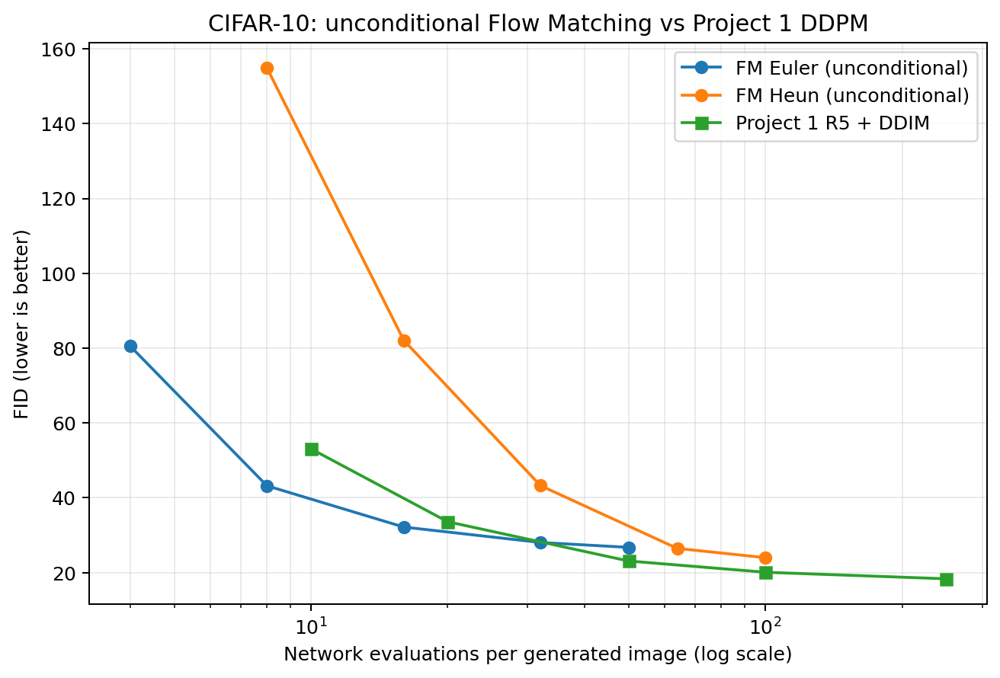

# Project 4：CIFAR-10 Flow Matching v2 实验报告

## 1. 实验设置与运行时间

本实验在 AutoDL 单张 NVIDIA GeForce RTX 4080 SUPER（32,760 MiB）上运行，环境为 Python
3.12.3、PyTorch 2.8.0+cu128 和 TorchVision 0.23.0+cu128。训练数据为 CIFAR-10 train，
模型为 32.62M 参数的 DiT-S，batch size 64，BF16 autocast，AdamW，随机种子 42，保存
50K 间隔快照并以 10K 间隔更新续训 checkpoint。两组实验分别使用无条件 dropout=1.0
和 conditional dropout=0.1；都训练到 200,000 optimizer steps。

| 阶段 | 实测用时 | 结果 |
|---|---:|---|
| CIFAR-10 下载与 MD5 校验 | 约 15 秒 | 固定镜像、170,498,071 字节 |
| 100-step BF16 冒烟运行 | 约 9.3 秒 | 约 10.8 step/s |
| Project 1 R5 + DDIM 五点扫描 | 34 分 49 秒 | 采样 2,006.3 秒，FID 计算 83.0 秒 |
| FM-U 训练 | 4.83 小时 | step 200,000，最终 loss 0.2013 |
| FM-C 训练 checkpoint 记录的累计时间 | 4.36 小时 | step 200,000，最终 loss 0.1665 |
| FM-U Euler/Heun 的 10 组 FID | 20.2 分钟 | 5,000 张生成图/组 |
| FM-C CFG 的 5 组 FID | 13.0 分钟 | 5,000 张生成图/组 |

FM-U 训练时与约 35 分钟的 Project 1 基线评测共用 GPU，因此两段时间不能简单相加为
总墙钟时间。FM-C 在日志达到 193K 后进程意外退出；从最后完整的 190K checkpoint 恢复，
重新计算未保存的 3K 步并继续到 200K。最终 checkpoint 的 4.36 小时累计计时不包括第一
次运行中这段被丢弃的计算。两次运行的原始训练日志与合并后的 CSV 均随结果提交。

## 2. Rectified Flow loss 推导

令噪声 $x_0\sim\mathcal N(0,I)$，数据样本为 $x_1$，时间 $t\sim U[0,1]$。采用线性概率路径

$$x_t=(1-t)x_0+t x_1.$$

对 $t$ 求导得到条件速度

$$u_t(x_t\mid x_1)=\frac{d x_t}{dt}=x_1-x_0.$$

网络 $v_\theta(x_t,t,y)$ 的 Conditional Flow Matching 目标为

$$\mathcal L_{CFM}=\mathbb E_{t,x_0,x_1,y}
  \left[\lVert v_\theta(x_t,t,y)-(x_1-x_0)\rVert_2^2\right].$$

实现先从 batch 图像构造 $x_1$，采样同形状高斯噪声和时间，再构造 $x_t$ 与 target
$x_1-x_0$。Conditional 训练以 10% 概率把标签替换为 null token 10；类别 embedding
大小为 `num_classes + 1`，所以该索引有效，并可供 CFG 使用。

最小化 CFM loss 与不可直接计算的边缘 FM loss 对网络输出的期望梯度相同。这里的等价是
优化梯度等价，不是单样本 loss 或两个 loss 的数值相等。

## 3. 采样方法与 CFG

Euler 从 $x(0)\sim\mathcal N(0,I)$ 出发，按 $t_i=i/N$ 积分：

$$x_{i+1}=x_i+v_\theta(x_i,t_i,y)\Delta t.$$

FM 的积分方向是从 0 到 1，更新项是加号。Heun 先做 Euler 预测，再在新位置和新时间
计算速度，并对两次速度取平均。一个 Heun 积分步需要两次网络前向，因此公平比较时按
实际网络求值次数（NFE）作横轴。

CFG 在线性速度场上组合无条件与条件预测：

$$v=v_u+s(v_c-v_u).$$

实现将两种标签的输入沿 batch 维合并为一次 batched model call，但其计算量仍相当于
两次单路前向；结果 JSON 同时记录 batched calls 和每张图的实际 network evaluations。

## 4. 统一 NFE-FID 评测

所有结果使用 EMA 0.9999、CIFAR-10 train 前 5,000 张真实图、5,000 张生成图、batch size
64 和 TorchMetrics `FrechetInceptionDistance(feature=2048, normalize=False)`。FM 与
Project 1 DDIM 都使用 seed 42 和同一 real-image 子集。FM 的完整原始数据见
[`results/fm_v2_unconditional_solvers.json`](results/fm_v2_unconditional_solvers.json)，
对照 DDIM 的原始数据见
[`../project2_samplers/results/p1_r5_ddim_5k.json`](../project2_samplers/results/p1_r5_ddim_5k.json)。

### FM-U 与 Project 1 R5 + DDIM

| 方法 | 实际 NFE/图 | 积分步数 | FID |
|---|---:|---:|---:|
| FM Euler | 4 | 4 | 80.5531 |
| FM Euler | 8 | 8 | 43.2211 |
| FM Euler | 16 | 16 | 32.1931 |
| FM Euler | 32 | 32 | 28.0684 |
| FM Euler | 50 | 50 | 26.7610 |
| FM Heun | 8 | 4 | 154.8813 |
| FM Heun | 16 | 8 | 82.1227 |
| FM Heun | 32 | 16 | 43.2588 |
| FM Heun | 64 | 32 | 26.4840 |
| FM Heun | 100 | 50 | 24.0062 |
| R5 + DDIM | 10 | 10 | 53.0907 |
| R5 + DDIM | 20 | 20 | 33.6099 |
| R5 + DDIM | 50 | 50 | 23.1206 |
| R5 + DDIM | 100 | 100 | 20.1105 |
| R5 + DDIM | 250 | 250 | 18.3625 |

两个低预算的错位比较中，FM Euler 的点估计更低：8 次网络评估时 FID 为 43.2211，
DDIM 10 次评估为 53.0907，低 9.8696；16 次评估时 FM 为 32.1931，DDIM 20 次评估为
33.6099，低 1.4167。但它们使用的 NFE 不同，且这里只测了各一个生成 seed。这两个点
说明当前 FM checkpoint 在这两组设置下结果较好，不能代表整个低 NFE 区间，也不能据此
宣称差异稳定或具有统计显著性。

同一 NFE 的已测点呈现相反结果：NFE 50 时 DDIM FID 23.1206，优于 FM Euler 的 26.7610；
NFE 100 时 DDIM 为 20.1105，优于 FM Heun 的 24.0062（FM Euler 未测 NFE 100）。Heun
在 NFE 8 和 16 时的 FID 分别为 154.8813 和 82.1227，也显示本实验的 FM 结果对求解器和
积分预算很敏感。因此，整体数据不支持“FM 在低步数下优于 DDIM”的一般结论；更准确的
表述是：FM Euler 在两个尚未严格对齐预算的低 NFE 点取得较低 FID，而对齐的 NFE 50 和
100 结果支持 DDIM 更好。

两边统一了 FID 实现、真实图像子集、生成图数和评测 seed，因此指标口径较一致；训练对象
却没有控制一致。FM 是 32.62M 参数 DiT-S，训练 200K 步、batch size 64、训练 seed 42；
DDIM 对应 Project 1 R5 的 U-Net，训练 78K 步、batch size 128、训练 seed 44。按步数乘
batch size 估算，两者分别处理约 1280 万和 998.4 万个训练样本实例。模型架构、优化轨迹
和训练预算均不同，所以这项实验比较的是两套已训练模型与采样器的组合，不能把差异单独
归因于 FM 或 DDIM 的采样原理。

每个设置只有 seed 42 的一次 FID，5,000 张生成图也不能给出跨 seed 波动范围。现有结果
可以描述这两个 checkpoint 的观测值，不能判断 1.4167 的 FID 差异是否能稳定复现。要检验
当前 checkpoint 的低预算表现，可先让两种方法都测 NFE `[4, 8, 10, 16, 20, 32, 50]`，
用多个生成 seed 重复并报告均值与标准差，同时记录每图网络评估次数和实际采样耗时；评测时
确保 GPU 不被其他任务占用。这样的补测可以回答“当前两套模型在低计算预算下谁表现更好”。
若要将结论归因于 FM 与 DDIM 方法本身，还需进一步控制网络规模、训练样本预算、训练步数
和调参预算，进行成组训练对照。

## 5. CFG scale 扫描

FM-C 固定 Euler 20 个积分步，扫描 CFG scale；因为每步需要无条件和条件两次预测，
每张图的有效网络求值数均为 40。

| CFG scale | 实际 NFE/图 | FID |
|---:|---:|---:|
| 1.0 | 40 | 23.5773 |
| 2.0 | 40 | **18.8105** |
| 3.0 | 40 | 23.6983 |
| 5.0 | 40 | 35.2425 |
| 7.5 | 40 | 44.9110 |

scale=2.0 在本次设置下最好；scale 从 3.0 起 FID 反弹，较大的 guidance 会放大条件方向，
在本实验中降低质量。完整数据见
[`results/fm_v2_conditional_cfg.json`](results/fm_v2_conditional_cfg.json)。预览图包括
[FM-U Heun 50 步网格](samples/fm_v2_unconditional/heun_nfe50_unconditional_cfg1.0_EMA_0.9999.png)
和 [类别 0 / airplane 的 FM-C 网格](samples/fm_v2_conditional/class_0/euler_nfe20_cfg_cfg3.0_EMA_0.9999.png)。

## 6. 自查问题

1. **Linear path 的条件速度**：$x_t=(1-t)x_0+t x_1$，直接对 $t$ 求导得到
   $u_t=x_1-x_0$，因此 target 不依赖 $t$。
2. **CFM 与 FM 的关系**：条件速度对 $x_1$ 取条件期望给出边缘速度场；平方损失关于
   网络输出的期望梯度相同，所以可以用可采样的条件路径训练边缘场。loss 数值不必相等。
3. **低 NFE 对比**：本次两个错位预算点中，FM Euler 的 FID 低于 DDIM；但在对齐的 NFE
   50 和 100 点上，DDIM 分别优于 FM Euler 和 FM Heun。由于训练架构、预算不同且每项
   只有一个评测 seed，本实验不能支持“FM 在低步数下总体优于 DDIM”，也不能把局部差异
   归因于采样方法本身。补测方案见第 4 节。
4. **Reflow**：用模型生成的新 $(x_0,x_1)$ 配对重新训练，使轨迹更直、更低曲率，减少
   少步数值积分误差，从而改善极少步甚至一步生成。
5. **Velocity CFG**：在同一 $(x_t,t)$ 上计算条件与无条件速度，然后线性组合。ODE 的
   瞬时速度可以被引导，因此形式是 $v_u+s(v_c-v_u)$，与噪声或 score 空间的 CFG 类似。

## 7. 结论与限制

TODO 16–18 的 loss、Euler sampler 和 velocity-space CFG 均在训练和评测流程中使用；
两组 DiT-S 都完成 200K 训练，发布了只含推理权重的 EMA checkpoint。最终仓库保留原始
评测 JSON、NFE-FID 图、训练 CSV、训练/评测日志、类别样图、哈希文件与复现清单；权重
作为 GitHub Release 附件，不放入 Git 对象库。

本次数据总体不支持“FM 在低步数下优于 DDIM”的结论。FM Euler 只在两个 NFE 未对齐的低
预算点取得较低 FID；相同 NFE 50 的结果由 DDIM 胜出，NFE 100 时 DDIM 也优于已测的 FM
Heun。现有结果比较的是两个架构与训练预算不同的 checkpoint，不能单独归因于采样算法。

FID 每个设置只跑一个 seed，5,000 张生成图带有单次采样噪声，微小差异应谨慎解释。对齐
两种方法的 NFE 网格并以多个生成 seed 重复，可估计当前 checkpoint 的结果波动；若要判断
方法本身的优劣，还需要控制模型和训练预算重新训练对照。CIFAR-10 低分辨率和 32.62M
模型规模也限制了绝对生成质量。
